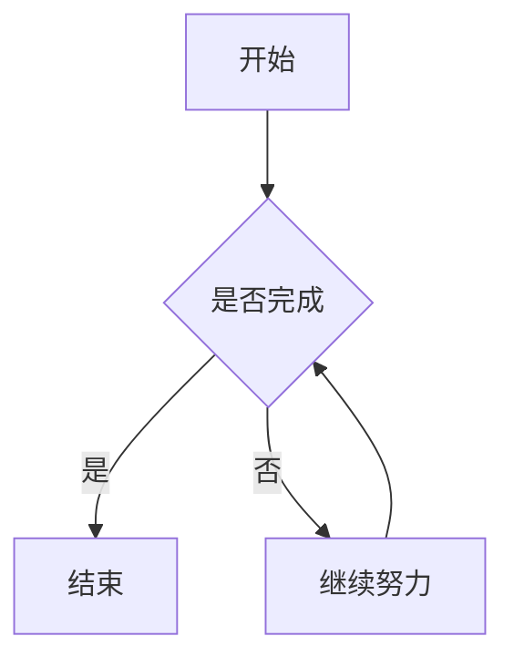
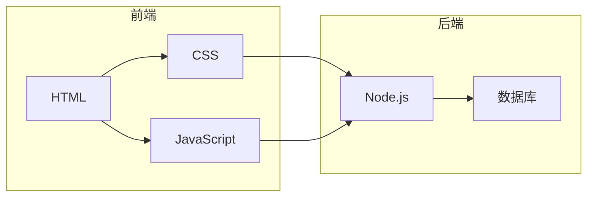
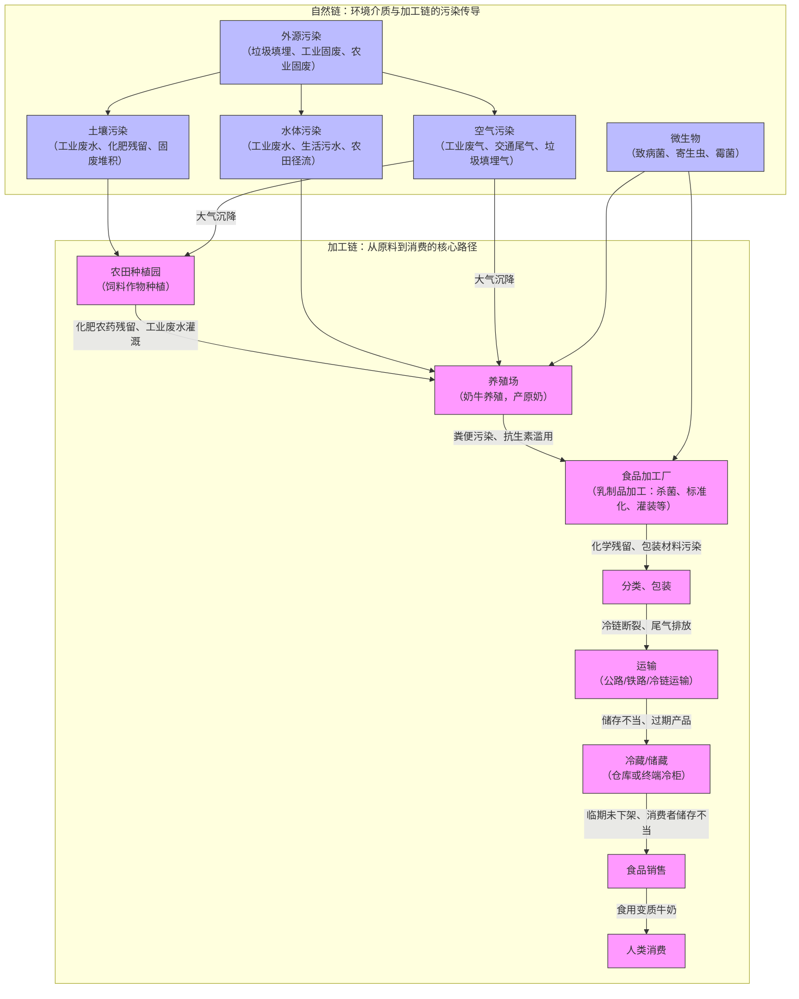

## 使用 fenced code block（推荐）



## 使用标签插件


graph TD
    A[起床] --> B{今天天气?}
    B -->|晴天| C[去公园]
    B -->|雨天| D[待在家]
    C --> E[散步]
    D --> F[看书]


## 更复杂的图表



## 错误语法测试（应显示错误提示）

```mermaid
graph TD
    A --> B
    this is invalid syntax
```

## 复杂 graph TD 图表（含 subgraph 和样式）

